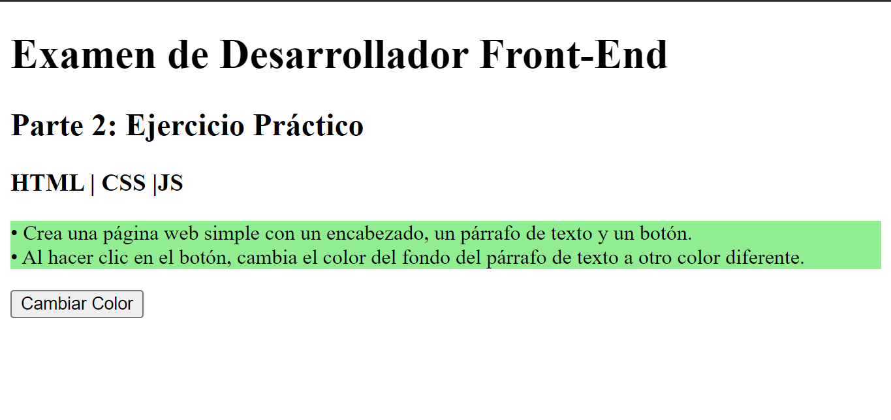
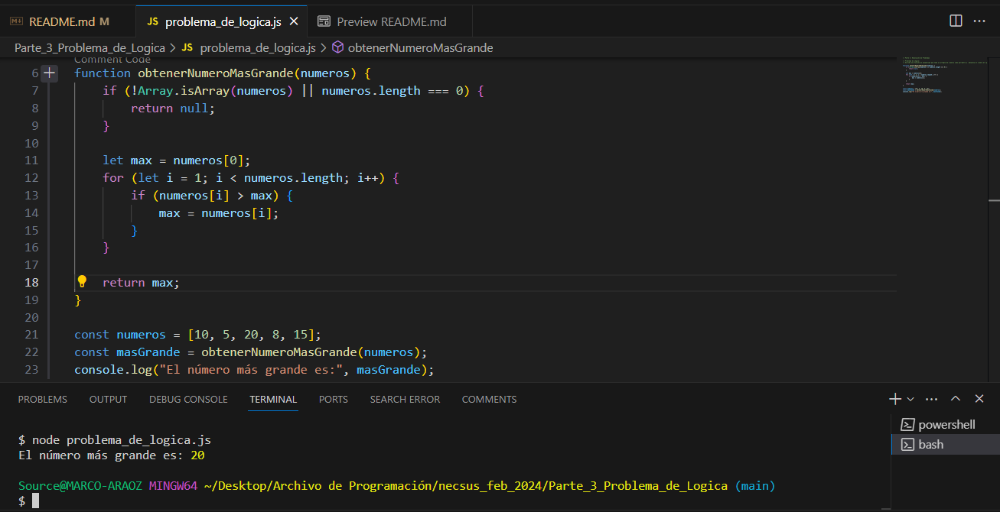
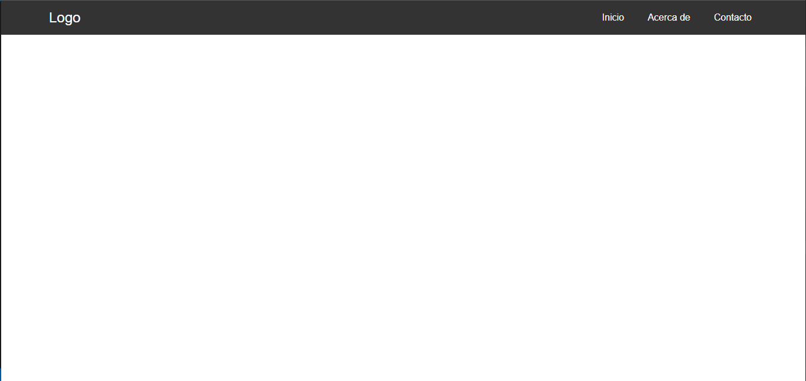
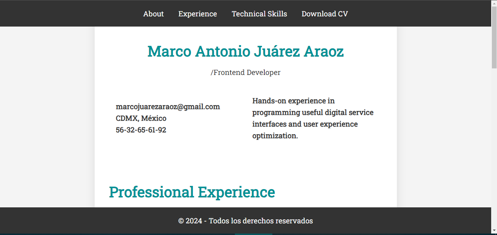
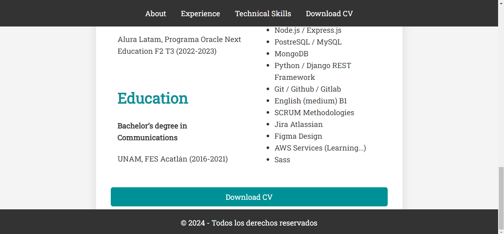

# Proyecto de Prueba Frontend

Este proyecto contiene varios ejercicios y proyectos prácticos de desarrollo frontend.

## Cómo Ejecutar el Proyecto

Para ejecutar el proyecto, abre los archivos `index.html` en cada carpeta en tu navegador.

## Estructura del Proyecto

El proyecto se divide en varias partes, cada una en su propia carpeta:

- `Parte_2_Ejercicio_Practico_HTML_CSS_JS`: Crea una página web simple con un encabezado, un párrafo de texto y un botón. Al hacer clic en el botón, cambia el color del fondo del párrafo de texto a otro color  diferente.

- `Parte_3_Problema_de_Logica`: Escribe una función en JavaScript que tome un arreglo de números como parámetro y  devuelva el número más grande.

- `Parte_4_Proyecto_Practico`: Desarrolla un componente de barra de navegación (navbar) completamente responsivo  utilizando HTML, CSS y opcionalmente JavaScript si es necesario.
Asegúrate de que la barra de navegación tenga al menos tres elementos de navegación y  que se adapte adecuadamente a diferentes tamaños de pantalla.

- `Parte_4_Proyecto_Practico_parte_2`: Crea tu CV como una página web integrando sass en donde este pueda ser descargado  mediante un botón en formato pdf.

